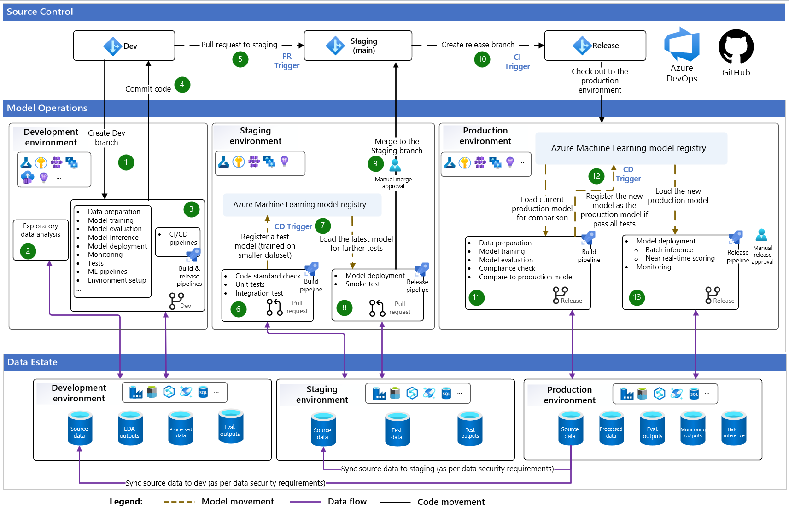

# Welcome to the MLOps Playground!

This repository serves as a playground for exploring and experimenting with MLOps using a deploy-code approach. Discover how to implement key components of MLOps in a modularized fashion, ensuring code quality through validation tests, and deploying models with parametrized CI/CD pipelines.

## What's Inside? 📦

- **Modularized MLOps Components**: Explore how to break down the MLOps process into modular components, promoting better code organization, maintainability, and reusability.

- **Validation Tests**: Learn about the importance of code quality through the implementation of validation tests.

- **CI/CD Pipelines as Code**: Discover the power of automating your deployment process with CI/CD pipelines as code, leveraging parametrized templates for reproducibility and efficient model deployments.

## Deploy-Code MLOps Reference Architecture 🏗️

The implementation example provided in this repository follows a deploy-code MLOps reference architecture as shown below:



The reference architecture outlines the interactions between three key components of MLOps: **Data**, **Model**, and **Code**. The deploy-code MLOps pattern emphasizes the importance of code quality and reproducibility, promoting the use of code for managing the ML workflow across the Development, Staging, and Production environments. Let's take a closer look at the high-level steps to exercise this implementation pattern:

* **Development (Dev) Environment**
  1. Data scientists and ML(Ops) engineers can explore and experiment with data and models in the Dev environment.
  2. Ad-hoc testing and exploratory tasks, such as exploratory data analysis, can also be performed in Dev to derive valuable insights during the development process.
  3. The Dev environment is also suitable for exploring different Continuous Integration and Continuous Deployment (CI/CD) approaches.
  4. Code artifacts created in Dev are typically managed in a source control system (e.g., Azure Repos or GitHub) under "Dev" branches. Ad-hoc exploratory code may not always be source controlled, especially if it is not intended to be reused.
  5. When the code artifacts are ready to be promoted to the Staging environment, it is recommended to create a pull request to merge the "Dev" branch into the "Staging" (main) branch. This process ensures that the code artifacts are reviewed and validated before they are promoted to the higher environment.


* **Staging Environment**

  6. The Staging environment is typically used to test the code artifacts in a more production-like environment before they are promoted to Production. The testing process may include code standard checks, security test, unit tests and integration test etc.
  7. It is also beneficial to test the build and deployment (CI/CD) process in the Staging environment.
  8. A smoke test can be performed in Staging to validate that the deployment procedure is working as expected, for example, by sending a request to the deployed model and validating the response.
  9. It is a common practice to include a manual approval step to review the code changes before merging the "Dev" branch into the "Staging" branch.
  10. When the code artifacts are ready to be promoted to the Production environment for release, a "Release" branch can be created from the "Staging" branch to trigger the production build and deployment process.

    &nbsp; 
    > **Note:**
    > The purpose of the testing in the Staging environment is to validate the code quality and the build and deployment mechanics. The model performance is often not validated in the Staging environment. Instead, the model is retrained using the code artifacts under the "Release" branch on the "Production" data to validate the model performance before deploying the model to Production.


* **Production Environment**

  11. The Production environment is used to build and deploy the solution for production use. Notably, the deploy-code MLOps architecture does not promote ML/AI models directly to Production. Instead, the model is retrained using the code artifacts under the "Release" branch on the "Production" data.
  12. Before deploying the model to Production, you want to compare the performance of the new model with the current in-production model to ensure that the new model is performing as expected.
  13. Although technically it is possible to automatically deploy the model to Production, it is recommended to include a manual approval step to review the model performance and possibly other pre-deployment checks before deploying the model to Production.  


## Implementation Tips 📝

Before diving into the code, here are some implementation tips to make maintaining the MLOps process a less daunting task:

- **Platform-agnostic modelling code**: Implement the core ML/AI modelling steps using platform-agnostic code (or as much as possible). This ensures that the code can be easily ported and executed on different platforms without major modifications. In this repository, the modelling code in the `src` folder is designed with this principle in mind.


- **Platform-specific deployment templates**: Utilize reusable templates, such as YAML templates, for platform-specific operational code. These templates provide a consistent and efficient way to deploy your ML models across different environments, taking advantage of the unique features and capabilities of each platform. The `operations` folder in this repository contains scripts that demonstrate various operational tasks, including creating ML pipelines using Azure Machine Learning, as well as examples of pull request validation, build, and release pipelines using Azure Pipelines.


- **Modularized implementation**: Break down your MLOps implementation into modular components. This allows for easier maintenance, scalability, and reuse of code. Each component can focus on a specific task. For example, in this repository, each Python script in the `src` folder is designed to focus on a specific task, such as data preprocessing, model training, or evaluation. This modular approach makes it easier to troubleshoot and enhance individual parts of the workflow.


- **Test "locally" before pull request**: Before submitting a pull request or merging code changes, it is recommended to first test your changes in a controlled environment. This helps catch potential issues and conflicts with the existing MLOps workflow. When we say "locally," it doesn't necessarily mean on your own laptop. For example, you can leverage [Azure Machine Learning managed compute instance](https://learn.microsoft.com/en-us/azure/machine-learning/concept-compute-instance?view=azureml-api-2) as your "local" development machine to take advantage of pre-configured ML packages, hardware drivers, and other ML development settings, including features like pre-configured MLflow tracking.


## Getting Started 🏁

Now, let's get started with some implementation details involved in three key development tasks: **Experiment**, **Test**, and **Operationalize**.

### **Experiment "Locally"**
Follow the following steps to experiment with the modelling code "locally" on your dev machine:


1. Clone the repository to your dev machine (consider using Azure ML compute instance as your "local" dev machine):
    ```bash
    git clone https://github.com/yuj18/mlops-with-azure-ml.git
    cd mlops-with-azure-ml
    ```
2. Create a Conda environment:
    ```bash
    conda env create -n credit_default -f environment/conda.yml
    conda activate credit_default
    ```
    If you don't have Conda installed, you can install it from [here](https://docs.conda.io/en/latest/miniconda.html).
3. Explore the `src` folder, which contains Python scripts for data preprocessing, model training, and evaluation etc. The usage example is provided as comments in the script. For example, you can run the following command to prepare the training and test data:
    ```bash
    cd src
    python data_prep.py --data_input_dir ../data/input --data_output_dir ../data/output --config_file ../config/modelling.json --no_logging
    ```
    Run the following command to train the model:
    ```bash
    python train.py --data_dir ../data/output --model_dir ../models --config_file ../config/modelling.json --no_logging
    ```
    Run the following command to evaluate the model:
    ```bash
    python evaluate.py --data_dir ../data/output --model_dir ../models --eval_dir ../eval --config_file ../config/modelling.json --no_logging
    ```
    Run the following command to register the model:
    ```bash
    python register.py --model_dir ../models --eval_dir ../eval --registry_dir ../registry --config_file ../config/modelling.json
    ```

### **Test before Pull Request**
Before submitting a pull request or merging code changes, it is recommended to test your changes to ensure code quality and identify any potential issues. The `tests` folder provides unit test examples that you can run on your dev machine:

1. Install the required Python packages to support testing:
    ```bash
    pip install -r environment/unit_test_requirements.txt
    ```
2. Run the unit tests:
    ```bash
    pytest -v tests
    ```
In addition to running unit tests, you can perform additional checks to ensure code quality and security:

* Code formating check using `flake8`:
  ```bash
  flake8 src --max-line-length 88 --output-file=flake8-testresults.xml --format junit-xml
  ```

  > **Tip:**
  > Formatter plugins like Visual Studio Code's [Black formatter](https://marketplace.visualstudio.com/items?itemName=ms-python.black-formatter) can be used to automatically format your code according to the specified style guide. It will not only save you time but also make the code more readable with consistent style.


* Security checking using `bandit` (e.g., detecting hard-coded secrets):
  ```bash
  bandit -r src notebooks
  ```

### **Operationalize on the Cloud**

Having successfully tested the code artifacts locally, it's time to take your ML workflow to the cloud and operationalize it for enhanced scalability and efficiency. The `operations` folder in this repository contains example YAML scripts that will guide you in creating the following pipelines on Azure through [Azure DevOps](https://learn.microsoft.com/en-us/azure/devops/user-guide/what-is-azure-devops?view=azure-devops):

#### **Pull Request Validation Pipeline**

The Pull Request Validation Pipeline is triggered when a pull request to a specified branch (e.g., the main branch) is submitted. It performs a series of checks, including code formatting and security checks, as well as running unit tests, integration tests (e.g., to test the end-to-end modeling workflow), and smoke test. The purpose of this pipeline is to ensure that the code changes meet the quality standards before merging them into the target branch. You can find an example implementation of a PR validation pipeline in `azure_pipelines/pr_validation_pipeline.yml`.

> **Information:** 
> Pull request trigger with Azure Repos Git is configured through Branch Policies. You can refer to [Azure Repos Branch policies and settings](https://learn.microsoft.com/en-us/azure/devops/repos/git/branch-policies?view=azure-devops&tabs=browser#build-validation) for detailed configuration steps.

#### **Build and Release Pipeline**

The Build and Release Pipeline is responsible for building and deploying the ML/AI solution. It is often triggered when a release branch is created or updated. The pipeline consists of two stages:

1. **Build**: This stage runs the end-to-end modeling workflow, including training and evaluating the ML model using the code in the "Release" branch. It trains the model on the production data and evaluate the model before proceeding to the deployment stage.

2. **Deploy**: Upon successful completion of the modeling workflow in the Build stage, the Deploy stage deploys the ML model to the specified "Production" environment. Pre-deployment manual approval can be configured by defining an approval condition in Azure DevOps for the target deployment environment. For detailed configuration steps, you can refer to the how-to guide [here](https://learn.microsoft.com/en-us/azure/devops/pipelines/process/approvals?view=azure-devops&tabs=check-pass#approvals). 

An example definition of the Build and Release Pipeline can be found in `azure_pipelines/cicd.yml`.

> **Information:** 
>To create Azure Pipelines with the provided YAML pipeline scripts, follow the step-by-step guide available [here](https://learn.microsoft.com/en-us/azure/machine-learning/how-to-setup-mlops-azureml). 


## Repository Structure 📂

Here's a brief overview of the folders included in this repository:

* **README.md:** The main documentation file providing an overview, instructions, and guidance for using the repository.
* **config:** Contains configuration files used for various purposes, such as modelling configurations, specifying deployment settings.
* **data:** This folder is intended for storing the data used in the ML workflow. It may include raw data, preprocessed data, or any other relevant datasets.
* **docs:** Provides additional documentation, guides, or resources related to the project.
* **environment:** Contains the necessary files for managing the project's environment such as conda environment file.
* **notebooks:** This folder is intended for storing interactive notebooks used for exploratory data analysis and experimentation.
* **operations:** Contains operational scripts and pipelines for deploying, testing, and creating the ML workflow on Azure.
* **src:** The source code directory is where you'll find the main implementation of the ML workflow, including data preprocessing, model training, evaluation, and other related functionalities.
* **tests:** This folder holds the unit tests or other testing scripts to ensure the quality and correctness of the code.

Feel free to explore each folder and leverage the provided structure to organize your project effectively.


## Let's Get Started! 🚀

Explore the provided examples, experiment with the MLOps reference architecture, and adapt it to your specific needs and requirements. 